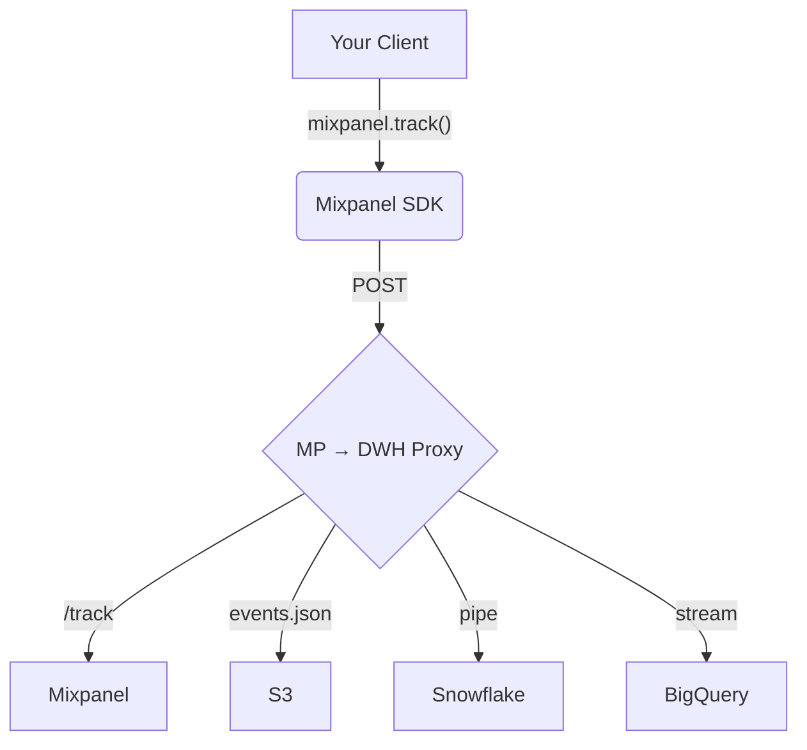

# Mixpanel → DWH Proxy

Mixpanel DWH Proxy sits between your client-side mixpanel tracking code, mixpanel's servers, and your data warehouses and lakes: 


[Tracking with a proxy](https://docs.mixpanel.com/docs/tracking-methods/sdks/javascript#tracking-via-proxy) is an analytics implementation best practice; this particular proxy is supercharged to send your Mixpanel data to multiple destinations.

Mixpanel → DWH Proxy is designed to be deployed in (cheap) serverless environments like Google Cloud Run, AWS Lambda, and Azure Functions. Examples deployment scripts are provided in the `/scripts` folder.

In addition to federating data to multiple destinations, this proxy allows you to modify each record before it gets sent to Mixpanel or other destinations, providing a flexible solution for data processing. 

This is a free alternative to Mixpanel's paid [Data Pipelines](https://mixpanel.com/docs/data-pipelines/) product; this proxy does not sync backfilled data, perform GDPR deletions, in your data warehouse, or have any SLA. 

## Demo

## Features
- Supports multiple data warehouse destinations:
  - BigQuery
  - Snowflake
  - Redshift
  - Mixpanel
  - Google Cloud Storage (GCS)
  - Amazon S3
  - Azure Blob Storage

- Catches requests to Mixpanel's `/track`, `/engage`, and `/groups` endpoints, and can write those rows as tables in your data warehouse or files in your data lake.

	- Schematizes standard record fields.

	- Additional schema fields can be added to the `events`, `users`, and `groups` tables.

	- Further processing can be done with a `transform` function. (WIP)

## 🗝 Authentication
Mixpanel DWH Proxy requires that you you to configure your pipeline by setting **environment variables**. Environment variables are case insensitive, and based on the service(s) you want to use.

You only need to set the environment variables for the services you want to use. For example, if you only want to send data to Mixpanel and BigQuery, you only need to set the REQUIRED environment variables for those services.


#### [ALL] Required Environment Variables 

- `DESTINATIONS`: Comma-separated list of destinations (`MIXPANEL`, `BIGQUERY`, `SNOWFLAKE`, `REDSHIFT`, `GCS`, `S3`, `AZURE`).

#### [ALL] Optional Environment Variables
- `PORT`: The port the server will listen on (default: `8080`).
- `FRONTEND_URL`: The URL of your frontend application (for CORS). Set to `none` to disable CORS.
- `RUNTIME`: The (serverless) runtime environment (`LOCAL`, `GCP`, `AWS`, `AZURE`).
- `EVENTS_TABLE_NAME`: The name of the events table (default: `events`).
- `USERS_TABLE_NAME`: The name of the users table (default: `users`).
- `GROUPS_TABLE_NAME`: The name of the groups table (default: `groups`).
- `MIXPANEL_TOKEN`: Your Mixpanel project token (optional).

#### [BIGQUERY] Required Environment Variables
- `bigquery_project`: Your BigQuery project ID.
- `bigquery_dataset`: Your BigQuery dataset ID.
- `bigquery_service_account_email`: Your BigQuery service account email.
- `bigquery_service_account_private_key`: Your BigQuery service account private key.
- `bigquery_keyfile`: Path to your BigQuery keyfile.

note: application default credentials **can** be used for authentication.

##### optional bigquery environment variables
- `pubsub_bad_topic`: if exists, any transient failures or failed inserts will be published on this topic.

### [PUBSUB] Required Environment Variables
- `pubsub_project`: Your PubSub project ID.
- `pubsub_service_account_email`: Your PubSub service account email.
- `pubsub_service_account_private_key`: Your PubSub service account private key.
- `pubsub_keyfile`: Path to your PubSub keyfile.

note: application default credentials **can** be used for authentication.

#### optional pubsub environment variables
- `pubsub_good_topic`: if exists, will publish messages for ALL rows (events/users/groups) to this topic; if this variable is NOT set, messages will be published to to each topic `EVENTS_TABLE_NAME`, `USERS_TABLE_NAME`, `GROUPS_TABLE_NAME`  based on the type of incoming request
- `pubsub_bad_topic`: if exists, any transient failures or failed inserts will be published on this topic.


#### [SNOWFLAKE] Required Environment Variables
- `snowflake_account`: Your Snowflake account name.
- `snowflake_user`: Your Snowflake username.
- `snowflake_password`: Your Snowflake password.
- `snowflake_database`: Your Snowflake database name.
- `snowflake_schema`: Your Snowflake schema name.
- `snowflake_warehouse`: Your Snowflake warehouse name.
- `snowflake_role`: Your Snowflake role.
- `snowflake_access_url`: Your Snowflake access URL.

#### [SNOWFLAKE] Optional Environment Variables
- `snowflake_stage`: Your Snowflake stage (optional).
- `snowflake_pipe`: Your Snowflake pipe (optional).

note: `snowflake_stage` and `snowflake_pipe` are required if you want to use the Snowflake stage (`COPY INTO`) and Snowpipe data loading features. They tend to have lower latency and scale better

if you want to use Snowpipe, you will need to provide the following additional environment variables:
- `snowflake_private_key`: Your Snowflake private key (required for Snowpipe).
- `snowflake_region`: Your Snowflake region  (required for Snowpipe).
- `snowflake_provider`: Your Snowflake provider  (required for Snowpipe).


#### [REDSHIFT] Required Environment Variables
- `redshift_workgroup`: Your Redshift workgroup.
- `redshift_database`: Your Redshift database name.
- `redshift_access_key_id`: Your Redshift access key ID.
- `redshift_secret_access_key`: Your Redshift secret access key.
- `redshift_session_token`: Your Redshift session token (optional).
- `redshift_region`: Your Redshift region.
- `redshift_schema_name`: Your Redshift schema name.

note: redshift has a 100kb per request limit, using a smaller batch size is recommended.

#### [GCS] Required Environment Variables
- `gcs_project`: Your GCS project ID.
- `gcs_bucket`: Your GCS bucket name.
- `gcs_service_account`: Your GCS service account email.
- `gcs_service_account_private_key`: Your GCS service account private key.
- `gcs_keyfile`: Path to your GCS keyfile.

note: application default credentials **can** be used for authentication.

#### [S3] Required Environment Variables
- `s3_bucket`: Your S3 bucket name.
- `s3_region`: Your S3 region.
- `s3_access_key_id`: Your S3 access key ID.
- `s3_secret_access_key`: Your S3 secret access key.

#### [AZURE] Required Environment Variables
- `azure_account`: Your Azure account name.
- `azure_key`: Your Azure account key.
- `azure_container`: Your Azure container name.
- `azure_connection_string`: Your Azure connection string (optional).

## 🚀 Deployment

#### Choose a `RUNTIME`:
To deploy the Mixpanel DWH Proxy, you can use a serverless platform like Google Cloud Run, AWS Lambda, or Azure Functions.

We provide ready-to-use deployment scripts for popular serverless platforms in the `/scripts` folder.

- **Google Cloud Run:** [`scripts/gcp-run-deploy.sh`](https://github.com/ak--47/mixpanel-dwh-proxy/blob/main/scripts/gcp-run-deploy.sh) or try [one click deploy](https://deploy.cloud.run?git_repo=https://github.com/ak--47/mixpanel-dwh-proxy)
- **Google Cloud Functions:** [`scripts/gcp-func-deploy.sh`](https://github.com/ak--47/mixpanel-dwh-proxy/blob/main/scripts/gcp-func-deploy.sh)
- **AWS Lambda:** [`scripts/aws-deploy.sh`](https://github.com/ak--47/mixpanel-dwh-proxy/blob/main/scripts/aws-deploy.sh)
- **Azure Functions:** [`scripts/deploy-azure.sh`](https://github.com/ak--47/mixpanel-dwh-proxy/tree/main/scripts)

^ All of these deployment script should output a publicly accessible URL for your proxy which you can use in your client-side code.

There is also a [`Dockerfile`](https://github.com/ak--47/mixpanel-dwh-proxy/blob/main/Dockerfile) in the root directory for building a Docker image, which can be deployed to any container runtime.

#### Configuring Mixpanel SDKs

Once deployed, you will need to implement the following client-side configuration which tells the Mixpanel SDK to route it's data through the proxy. We do this by pointing the Mixpanel SDK to the `PROXY_URL` as it's `api_host`, we also set a `MIXPANEL_CUSTOM_LIB_URL` to use our proxy, and then we initialize the SDK like normal:

```javascript
const PROXY_URL = `http://localhost:8080`; // the URL of your deployed proxy
const MIXPANEL_CUSTOM_LIB_URL = `${PROXY_URL}/lib.min.js`;
// Mixpanel snippet
(function (f, b) { ... })(document, window.mixpanel || []);

mixpanel.init("my-proj-token", { api_host: PROXY_URL });

// This event will get sent to your Mixpanel project via the proxy
mixpanel.track("test", { "foo": "bar" });
```

## Endpoints
- `/track`: For tracking Mixpanel events.
- `/engage`: For updating Mixpanel user profiles.
- `/groups`: For updating Mixpanel groups.
- `/ping`: Health check endpoint.
- `/drop`: Drops tables in the connected data warehouses (disabled in production).

## Example Request
To send a track event to Mixpanel and your configured DWHs, make a POST request to the `/track` endpoint:

```bash
curl -X POST http://localhost:8080/track -H "Content-Type: application/json" -d '{
  "event": "test_event",
  "properties": {
    "distinct_id": "some_id",
    "token": "your_mixpanel_token",
    "time": 1234567890,
    "property_key": "property_value"
  }
}'
```

## Example Response
You should receive a response with the status of the request, and all the destinations the event was sent to:

```json
[
	{
		"name": "azure",
		"result": { ...	}
	},
	{
		"name": "mixpanel",
		"result": { ...	}
	},
	{
		"name": "bigquery",
		"result": { ...	}
	},
	{
		"name": "s3",
		"result": { ...	}
	},
	{
		"name": "gcs",
		"result": { ...	}
	},
	{
		"name": "snowflake",
		"result": { ...	},
					
	},
	{
		"name": "redshift",
		"result": { ...	}
	}
]
```

## Logging
Logging behavior is controlled by the `NODE_ENV` environment variable:
- `dev`: Verbose logging enabled.
- `prod`: Only structured logs and errors.

## Development
To run the proxy locally for development:

1. Clone the repository.
2. Run `npm install` to install dependencies.
3. Set up the required environment variables in a `.env` file.
4. Run `npm start` to start the server.
5. Use `npm run dev` to start the server with nodemon.
6. Use `npm run test` to run the test suite.

## Contributing
Contributions are welcome! Please submit a pull request or open an issue to discuss any changes.

## License
This project not licensed under any open-source license. You are free to use, modify, and distribute the code as you see fit. This is a free and open-source project, and we hope it helps you with your data pipeline.
